## First-Come, First-Served (FCFS) Scheduling

**Definition**:
FCFS is the simplest CPU scheduling algorithm where the process that arrives first in the ready queue is scheduled first.

**Key Features**:

* **Queue Type**: FIFO (First In, First Out)
* **Type**: Non-preemptive
* **Execution Rule**: The CPU is assigned to the process at the **head** of the queue.
* **Drawback**: **Convoy effect** — short processes may wait long times behind longer ones, causing low CPU and device utilization.
* **Waiting Time**: Can be high and varies if burst times differ significantly.

## Gantt Chart Example

### Given:

| Process | Arrival Time | Burst Time |
| ------- | ------------ | ---------- |
| P1      | 0            | 5          |
| P2      | 1            | 3          |
| P3      | 2            | 8          |
| P4      | 3            | 6          |

### Assumption

* All arrive in order: P1 → P2 → P3 → P4
* FCFS ignores arrival time if they’re queued.

### Gantt Chart

```mermaid
gantt
    title FCFS Process Scheduling
    dateFormat X
    axisFormat %s

    section Process Execution
    P1 (5)    :p1, 0, 5
    P2 (3)    :p2, 5, 8
    P3 (8)    :p3, 8, 16
    P4 (6)    :p4, 16, 22
```

### Calculations

| Process | Arrival Time | Burst Time | Start Time | Completion Time | Waiting Time | Turnaround Time |
| ------- | ------------ | ---------- | ---------- | --------------- | ------------ | --------------- |
| P1      | 0            | 5          | 0          | 5               | 0            | 5               |
| P2      | 1            | 3          | 5          | 8               | 4            | 7               |
| P3      | 2            | 8          | 8          | 16              | 6            | 14              |
| P4      | 3            | 6          | 16         | 22              | 13           | 19              |

### Averages

* **Average Waiting Time** = (0 + 4 + 6 + 13) / 4 = **5.75**
* **Average Turnaround Time** = (5 + 7 + 14 + 19) / 4 = **11.25**

This demonstrates how FCFS can lead to high waiting times especially when short processes follow long ones.
