## Multilevel Feedback Queue Scheduling

**Definition**:
Multilevel Feedback Queue Scheduling is an advanced version of Multilevel Queue Scheduling where **processes can move between queues** based on their behavior and requirements. It aims to dynamically adjust priorities to optimize both CPU-bound and I/O-bound processes.

**Key Features**:

* **Queue Structure**: Multiple queues, each with its own priority level and scheduling algorithm
* **Dynamic Process Movement**:

  * **Demotion**: A process that uses too much CPU time is moved to a lower-priority queue.
  * **Promotion**: A process that waits too long in a low-priority queue is moved up — this is aging, to prevent starvation.
  * **Behavior-Based Scheduling**:
      * *CPU-bound processes tend to move down*
      * *I/O-bound or interactive processes stay at higher priorities*
      * *Adaptivity: Better response time for interactive jobs while ensuring fairness for all*

**Defined By**:

1. Number of Queues
2. Scheduling Algorithm per Queue (e.g., RR for top, FCFS for bottom)
3. Rules for Promotion
4. Rules for Demotion
5. Initial Queue Assignment

## Gantt Chart Example

### Queue Setup

* Q0 (Priority 1) — **Round Robin**, Quantum = 2
* Q1 (Priority 2) — **Round Robin**, Quantum = 4
* Q2 (Priority 3) — **FCFS**

### Rules

* New processes enter Q0
* If a process uses full quantum in Q0 → move to Q1
* If it uses full quantum in Q1 → move to Q2
* If it waits too long in Q2 → move up to Q1 (aging)

### Given:

| Process | Arrival Time | Burst Time |
| ------- | ------------ | ---------- |
| P1      | 0            | 6          |
| P2      | 1            | 4          |
| P3      | 2            | 9          |

### Assumptions:

* All processes enter Q0
* Apply feedback rules for demotion

### Execution Breakdown:

1. t=0–2: P1 (Q0) uses full quantum → demote to Q1
2. t=2–4: P2 (Q0) uses full quantum → demote to Q1
3. t=4–6: P3 (Q0) uses full quantum → demote to Q1
4. t=6–10: P1 (Q1, 4 units quantum) → finishes (remaining 4 units)
5. t=10–12: P2 (Q1, remaining 2 units) → finishes
6. t=12–16: P3 (Q1, 4 units) → uses full quantum → demote to Q2
7. t=16–21: P3 (Q2, remaining 3 units) → finishes

### Gantt Chart

```mermaid
gantt
    title Multilevel Feedback Queue Scheduling
    dateFormat X
    axisFormat %s

    section Q0 (RR, q=2)
    P1 (2)     :p1a, 0, 2
    P2 (2)     :p2a, 2, 4
    P3 (2)     :p3a, 4, 6

    section Q1 (RR, q=4)
    P1 (4)     :p1b, 6, 10
    P2 (2)     :p2b, 10, 12
    P3 (4)     :p3b, 12, 16

    section Q2 (FCFS)
    P3 (3)     :p3c, 16, 19
```

### Calculations

| Process | Arrival | Burst | Completion | Turnaround  | Waiting |
| ------- | ------- | ----- | ---------- | ----------- | ------- |
| P1      | 0       | 6     | 10         | 10 - 0 = 10 | 4       |
| P2      | 1       | 4     | 12         | 12 - 1 = 11 | 7       |
| P3      | 2       | 9     | 19         | 19 - 2 = 17 | 8       |

### Averages

* **Average Waiting Time** = (4 + 7 + 8) / 3 = **6.33**
* **Average Turnaround Time** = (10 + 11 + 17) / 3 = **12.67**

