## Multilevel Queue Scheduling

**Definition**:
Multilevel Queue Scheduling divides the ready queue into multiple separate queues, each with its own priority level and scheduling algorithm. A process is permanently assigned to one of these queues based on characteristics like memory size, type (interactive/batch), or priority.

**Key Features**:

* **Queue Structure**: Multiple distinct queues (e.g., Foreground, Background)
* **Process Assignment**: Permanent to one queue
* **Scheduling Within Queue**: Each queue can have a different scheduling algorithm (e.g., RR for Foreground, FCFS for Background)
* **Scheduling Among Queues**:

  * **Fixed Priority Scheduling**: Always schedule from highest priority queue first
  * **Time Slicing Among Queues**: CPU time split across queues (e.g., 80% to Foreground, 20% to Background)
* **Drawback**: Processes in lower-priority queues can suffer starvation
* **Solution**: Time slicing across queues or **aging** within queues

## Gantt Chart Example

### Queue Setup

* **Foreground Queue (Priority 1)** – Scheduled with Round Robin (Time Quantum = 2)
* **Background Queue (Priority 2)** – Scheduled with FCFS
* **CPU Time Split**: 80% Foreground, 20% Background (in simple alternation)

### Given:

#### Foreground Queue (RR):

| Process | Arrival Time | Burst Time |
| ------- | ------------ | ---------- |
| F1      | 0            | 4          |
| F2      | 1            | 3          |

#### Background Queue (FCFS):

| Process | Arrival Time | Burst Time |
| ------- | ------------ | ---------- |
| B1      | 2            | 5          |

### Assumptions:

* RR with quantum = 2 for Foreground
* 4 units Foreground execution → 1 unit Background execution

### Execution Order:

* t=0–2: F1 (RR quantum)
* t=2–4: F2 (RR quantum)
* t=4–5: B1 (1 unit from background)
* t=5–7: F1 (remaining 2 units)
* t=7–8: B1 (1 unit)
* t=8–10: F2 (remaining 1 unit)
* t=10–14: B1 (remaining 3 units)

### Gantt Chart

```mermaid
gantt
    title Multilevel Queue Scheduling
    dateFormat X
    axisFormat %s

    section Foreground (RR)
    F1 (2)     :f1a, 0, 2
    F2 (2)     :f2a, 2, 4
    F1 (2)     :f1b, 5, 7
    F2 (1)     :f2b, 8, 9

    section Background (FCFS)
    B1 (1)     :b1a, 4, 5
    B1 (1)     :b1b, 7, 8
    B1 (3)     :b1c, 9, 12
```

### Calculations

| Process | Arrival Time | Burst Time | Completion Time | Turnaround Time | Waiting Time |
| ------- | ------------ | ---------- | --------------- | --------------- | ------------ |
| F1      | 0            | 4          | 7               | 7 - 0 = 7       | 3            |
| F2      | 1            | 3          | 9               | 9 - 1 = 8       | 5            |
| B1      | 2            | 5          | 12              | 12 - 2 = 10     | 5            |

### Averages

* **Average Waiting Time** = (3 + 5 + 5) / 3 = **4.33**
* **Average Turnaround Time** = (7 + 8 + 10) / 3 = **8.33**
