## Priority Scheduling

**Definition**:
Priority Scheduling assigns the CPU to the process with the **highest priority** (lowest numerical value, if lower number means higher priority). It can be **preemptive** or **non-preemptive** based on the system’s configuration.

**Key Features**:

* **Type**: **Can be Preemptive or Non-preemptive**
* **Execution Rule**: CPU is allocated to the process with the **highest priority**.
* **Tie-Breaker**: FCFS is used if two processes have the same priority.
* **Drawback**: May lead to **starvation** for lower-priority processes.
* **Solution to Starvation**: **Aging**, which increases priority the longer a process waits.

## Gantt Chart Example (Non-Preemptive Priority)

### Given:

| Process | Arrival Time | Burst Time | Priority |
| ------- | ------------ | ---------- | -------- |
| P1      | 0            | 10         | 3        |
| P2      | 2            | 1          | 1        |
| P3      | 3            | 2          | 4        |
| P4      | 4            | 1          | 2        |

### Execution Trace
> (Lower number = higher priority)

* **t=0** → P1 runs (no other processes yet)
* **t=10** → P2 runs (priority 1)
* **t=11** → P4 runs (priority 2)
* **t=12** → P3 runs (priority 4)

### Gantt Chart

```mermaid
gantt
    title Priority Scheduling (Non-Preemptive)
    dateFormat X
    axisFormat %s

    section Process Execution
    P1 (10)   :p1, 0, 10
    P2 (1)    :p2, 10, 11
    P4 (1)    :p4, 11, 12
    P3 (2)    :p3, 12, 14
```

### Calculations

| Process | Arrival Time | Burst Time | Completion Time | Turnaround Time | Waiting Time |
| ------- | ------------ | ---------- | --------------- | --------------- | ------------ |
| P1      | 0            | 10         | 10              | 10 - 0 = 10     | 0            |
| P2      | 2            | 1          | 11              | 11 - 2 = 9      | 8            |
| P3      | 3            | 2          | 14              | 14 - 3 = 11     | 9            |
| P4      | 4            | 1          | 12              | 12 - 4 = 8      | 7            |

### Averages

* **Average Waiting Time** = (0 + 8 + 9 + 7) / 4 = **6.0**
* **Average Turnaround Time** = (10 + 9 + 11 + 8) / 4 = **9.5**
