## Round Robin (RR) Scheduling

**Definition**:
Round Robin is a **preemptive** CPU scheduling algorithm where each process is assigned a **fixed time quantum**. Processes are scheduled in a circular order. If a process’s burst time exceeds the quantum, it is **preempted** and moved to the end of the ready queue.

**Key Features**:

* **Type**: **Preemptive**
* **Execution Rule**: Each process gets the CPU for **at most one time quantum**.
* **Queue Type**: Circular **FIFO**
* **Fairness**: Every process gets an **equal share** of the CPU over time.
* **Preemption**: Occurs after **quantum expires**.
* **Drawback**: High context switching overhead if **quantum is too small**.

## Gantt Chart Example (Quantum = 4)

### Given:

| Process | Arrival Time | Burst Time |
| ------- | ------------ | ---------- |
| P1      | 0            | 5          |
| P2      | 1            | 4          |
| P3      | 2            | 2          |
| P4      | 3            | 1          |

### Execution Trace (Quantum = 4)

* **t=0** → P1 runs for 4 → remaining = 1
* **t=4** → P2 runs for 4 → finishes
* **t=8** → P3 runs for 2 → finishes
* **t=10** → P4 runs for 1 → finishes
* **t=11** → P1 runs for 1 → finishes

### Gantt Chart

```mermaid
gantt
    title Round Robin Scheduling (Quantum = 4)
    dateFormat X
    axisFormat %s

    section Process Execution
    P1 (4)   :p1a, 0, 4
    P2 (4)   :p2, 4, 8
    P3 (2)   :p3, 8, 10
    P4 (1)   :p4, 10, 11
    P1 (1)   :p1b, 11, 12
```

### Calculations

| Process | Arrival Time | Burst Time | Completion Time | Turnaround Time | Waiting Time |
| ------- | ------------ | ---------- | --------------- | --------------- | ------------ |
| P1      | 0            | 5          | 12              | 12 - 0 = 12     | 12 - 5 = 7   |
| P2      | 1            | 4          | 8               | 8 - 1 = 7       | 3            |
| P3      | 2            | 2          | 10              | 10 - 2 = 8      | 6            |
| P4      | 3            | 1          | 11              | 11 - 3 = 8      | 7            |

### Averages

* **Average Waiting Time** = (7 + 3 + 6 + 7) / 4 = **5.75**
* **Average Turnaround Time** = (12 + 7 + 8 + 8) / 4 = **8.75**

This example shows that Round Robin gives each process a fair chance to execute, but context switches and response times can vary depending on the quantum and arrival patterns.
