## Shortest Job First (SJF) Scheduling

**Definition**:
SJF is a CPU scheduling algorithm where the process with the **smallest CPU burst time** is scheduled **next**.

**Key Features**:

* **Type**: Can be **Non-preemptive** or **Preemptive** (Shortest Remaining Time First - SRTF)
* **Execution Rule**: CPU is assigned to the process with the **shortest next CPU burst**.
* **Tie-Breaker**: If two processes have the same burst time, **FCFS** is used.
* **Difficulty**: Actual next CPU burst time is **unknown**, must be predicted (e.g., using exponential averaging).
* **Drawback**: Potential for **starvation** of longer jobs.

## Gantt Chart Example (Non-Preemptive SJF)

### Given:

| Process | Arrival Time | Burst Time |
| ------- | ------------ | ---------- |
| P1      | 0            | 6          |
| P2      | 1            | 8          |
| P3      | 2            | 7          |
| P4      | 3            | 3          |

### Execution Order (Non-Preemptive SJF)

At time 0 → only P1 is available → run P1
At time 6 → P2, P3, P4 are available → choose shortest: P4
At time 9 → P2, P3 are available → choose P3
At time 16 → run P2

### Gantt Chart

```mermaid
gantt
    title Non-Preemptive SJF Process Scheduling
    dateFormat X
    axisFormat %s

    section Process Execution
    P1 (6)    :p1, 0, 6
    P4 (3)    :p4, 6, 9
    P3 (7)    :p3, 9, 16
    P2 (8)    :p2, 16, 24
```

### Calculations

| Process | Arrival Time | Burst Time | Start Time | Completion Time | Waiting Time | Turnaround Time |
| ------- | ------------ | ---------- | ---------- | --------------- | ------------ | --------------- |
| P1      | 0            | 6          | 0          | 6               | 0            | 6               |
| P2      | 1            | 8          | 16         | 24              | 15           | 23              |
| P3      | 2            | 7          | 9          | 16              | 7            | 14              |
| P4      | 3            | 3          | 6          | 9               | 3            | 6               |

### Averages

* **Average Waiting Time** = (0 + 15 + 7 + 3) / 4 = **6.25**
* **Average Turnaround Time** = (6 + 23 + 14 + 6) / 4 = **12.25**
