## Shortest Remaining Time First (SRTF) Scheduling

**Definition**:
SRTF is the **preemptive** version of Shortest Job First (SJF), where the process with the **least remaining CPU burst time** is executed next. If a **new process arrives** with a **shorter remaining time** than the currently executing one, **preemption** occurs.

**Key Features**:

* **Type**: **Preemptive**
* **Execution Rule**: Always run the process with the **shortest remaining time**.
* **Tie-Breaker**: If two processes have the same remaining time, **FCFS** is used.
* **Preemption**: Occurs when a new process has **less remaining time** than the current process.
* **Drawback**: Longer processes may suffer from **starvation**.
* **Estimation Issue**: Requires knowledge or prediction of the **remaining CPU time**.

## Gantt Chart Example (SRTF)

### Given:

| Process | Arrival Time | Burst Time |
| ------- | ------------ | ---------- |
| P1      | 0            | 8          |
| P2      | 1            | 4          |
| P3      | 2            | 9          |
| P4      | 3            | 5          |

### Execution Trace

* **t=0** → P1 arrives → run P1
* **t=1** → P2 arrives (4 < 7) → preempt P1, run P2
* **t=2** → P3 arrives (9 > 3) → continue P2
* **t=3** → P4 arrives (5 > 2) → continue P2
* **t=5** → P2 finishes → pick shortest: P4 (5), P1 (7), P3 (9) → run P4
* **t=10** → P4 finishes → pick shortest: P1 (7), P3 (9) → run P1
* **t=17** → P1 finishes → run P3
* **t=26** → P3 finishes

### Gantt Chart

```mermaid
gantt
    title SRTF (Preemptive SJF) Process Scheduling
    dateFormat X
    axisFormat %s

    section Process Execution
    P1 (start) :p1a, 0, 1
    P2 (full)  :p2, 1, 5
    P4 (full)  :p4, 5, 10
    P1 (rest)  :p1b, 10, 17
    P3 (full)  :p3, 17, 26
```

### Calculations

| Process | Arrival Time | Burst Time | Completion Time | Turnaround Time | Waiting Time |
| ------- | ------------ | ---------- | --------------- | --------------- | ------------ |
| P1      | 0            | 8          | 17              | 17 - 0 = 17     | 17 - 8 = 9   |
| P2      | 1            | 4          | 5               | 5 - 1 = 4       | 0            |
| P3      | 2            | 9          | 26              | 26 - 2 = 24     | 15           |
| P4      | 3            | 5          | 10              | 10 - 3 = 7      | 2            |

### Averages

* **Average Waiting Time** = (9 + 0 + 15 + 2) / 4 = **6.5**
* **Average Turnaround Time** = (17 + 4 + 24 + 7) / 4 = **13.0**

This example demonstrates how SRTF aggressively preempts longer processes for shorter ones, reducing turnaround for shorter jobs but potentially increasing waiting for longer ones.
