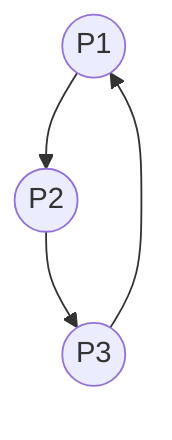

Deadlock detection allows the operating system to let deadlocks occur and then recognize and recover from them.

## 1. Single Instance of Every Resource Type

**Representation** – a **wait-for graph**

* **Nodes**: processes
* **Edge `Pi → Pj`**: `Pi` is waiting for a resource held by `Pj`.

**Detection rule**

* Periodically search the wait-for graph for a **cycle**.
* **Cycle present ⇒ deadlock.**
* **No cycle ⇒ no deadlock.**



## 2. Several Instances of Each Resource Type

Use three data structures ( `m` resource types, `n` processes ):

| Name           | Size    | Meaning                                                |
| -------------- | ------- | ------------------------------------------------------ |
| **Available**  | `1 × m` | Instances of each type not allocated to any process    |
| **Allocation** | `n × m` | Instances of each type currently held by each process  |
| **Request**    | `n × m` | Remaining resources each process still needs to finish |

#### Detection Algorithm

```
1  Work ← Available
2  for each i                       // initialize Finish
       if Allocation[i] ≠ 0
            Finish[i] ← false
       else Finish[i] ← true

3  repeat
       find i s.t. Finish[i] = false  and  Request[i] ≤ Work
       if such i exists
             Work ← Work + Allocation[i]
             Finish[i] ← true
       else exit repeat

4  If any Finish[i] = false  ⇒  those processes are deadlocked
```

## Example

**System**: 5 processes (P0–P4), 3 resource types: A(7), B(2), C(6)
**Snapshot at T₀**

|        | **Allocation** |   |   | **Request** |   |   |   |
| ------ | -------------- | - | - | ----------- | - | - | - |
|        | A              | B | C |             | A | B | C |
| **P0** | 0              | 1 | 0 |             | 0 | 0 | 0 |
| **P1** | 2              | 0 | 0 |             | 2 | 0 | 2 |
| **P2** | 3              | 0 | 3 |             | 0 | 0 | 0 |
| **P3** | 2              | 1 | 1 |             | 1 | 0 | 0 |
| **P4** | 0              | 0 | 2 |             | 0 | 0 | 2 |

`Available = [0, 0, 0]`

**Run detection algorithm**

1. `Work = [0,0,0]`
2. `Finish = [false, false, false, false, false]` (all hold resources)

Iterative search:

| Iteration | Chosen i | Condition `Request[i] ≤ Work` | Work after release          | Finish array |
| --------- | -------- | ----------------------------- | --------------------------- | ------------ |
| 1         | P0       | `[0,0,0] ≤ [0,0,0]` ✔         | `Work += [0,1,0] → [0,1,0]` | T F F F F    |
| 2         | P2       | `[0,0,0] ≤ [0,1,0]` ✔         | `Work += [3,0,3] → [3,1,3]` | T F T F F    |
| 3         | P3       | `[1,0,0] ≤ [3,1,3]` ✔         | `Work += [2,1,1] → [5,2,4]` | T F T T F    |
| 4         | P1       | `[2,0,2] ≤ [5,2,4]` ✔         | `Work += [2,0,0] → [7,2,4]` | T T T T F    |
| 5         | P4       | `[0,0,2] ≤ [7,2,4]` ✔         | `Work += [0,0,2] → [7,2,6]` | T T T T T    |

All `Finish[i] = true` ⇒ **no deadlock**.

## New Request Produces Deadlock

Later P2 requests one more C (`Request[P2]` becomes `[0,0,1]`).

`Available` still `[0,0,0]`

Running algorithm again:

* P0 can still finish first → `Work = [0,1,0]`
* No other `Request[i] ≤ Work`

`Finish = [true, false, false, false, false]`

Processes **P1, P2, P3, P4 remain false** ⇒ **deadlock exists** involving those four processes.

## Invocation Frequency

* **Trade-off**

  * Frequent checks → higher overhead, quicker detection.
  * Infrequent checks → lower overhead, deadlocks may persist longer.

* **Recovery** after detection typically involves:

  * **Process termination** or **resource pre-emption**
  * Roll back one process per detected cycle to break each deadlock set.

