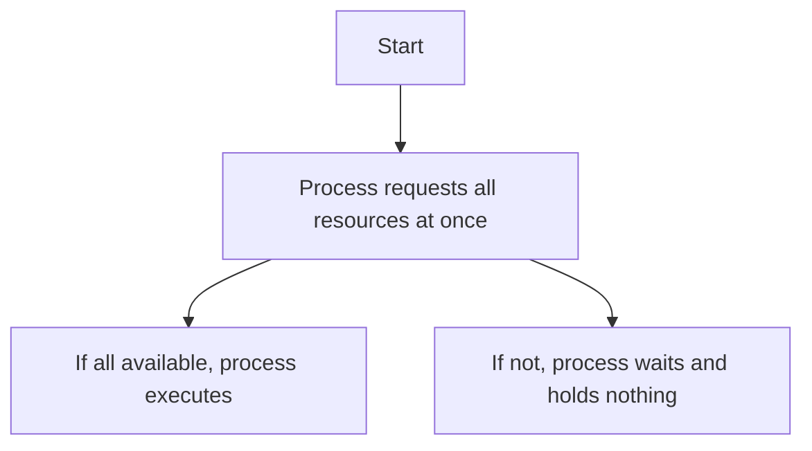
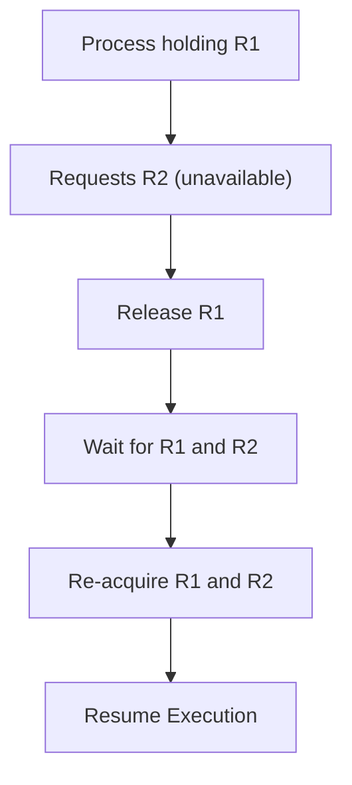
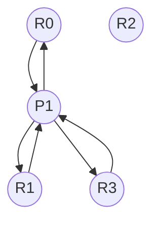

Deadlock can be prevented by breaking one of the four necessary conditions:

### 1. Mutual Exclusion

* **Condition**: Only one process at a time can hold a resource.
* **Prevention**: Not needed for sharable resources (like read-only files).
* **Required** only for non-sharable resources (like printers, files for writing).

### 2. Hold and Wait

* **Condition**: A process is holding at least one resource and waiting for others.
* **Prevention Strategy**:

  * Force processes to request all resources at once
  * OR allow them to request resources only when holding none



### 3. No Preemption

* **Condition**: Resources cannot be forcibly taken
* **Prevention Strategy**:

  * If a process holding resources requests another unavailable resource, all held resources are released
  * The process is suspended until all needed resources (old + new) are available again



### 4. Circular Wait

* **Condition**: A circular chain of waiting processes exists.
* **Prevention Strategy**:

  * Impose a **total ordering** on all resources.
  * Processes must request resources in **ascending order** only.

**Example**

```plaintext
Let: R0 < R1 < R2 < R3

Allowed:
P1 requests R0 → R1 → R3

Disallowed:
P2 holds R3, requests R0 (violates ascending order)
```

#### Visual Representation:



If all processes follow this order, circular wait **cannot occur**.
