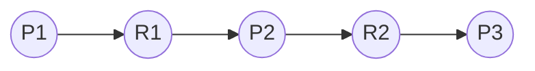
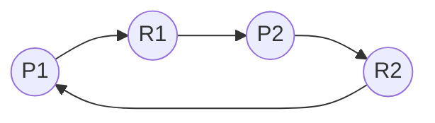
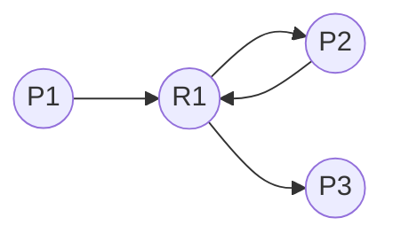

##  Concept

* A **Resource Allocation Graph** models the state of resource usage in a system.
* The graph consists of:

  * **Processes** (`P1`, `P2`, ..., `Pn`)
  * **Resource Types** (`R1`, `R2`, ..., `Rm`)
* There are **two types of edges**:

  * **Request edge**: From a process to a resource (e.g., `P1 --> R1`)
  * **Assignment edge**: From a resource to a process (e.g., `R1 --> P1`)

## Case 1: No Cycle

### Explanation

* P1 is requesting R1
* R1 is assigned to P2
* P2 is requesting R2
* R2 is assigned to P3

There is no cycle in the graph — hence, no deadlock

## Case 2: Cycle with 1 Resource Instance

### Explanation

* P1 requests R1
* R1 is assigned to P2
* P2 requests R2
* R2 is assigned to P1

There is a cycle: `P1 → R1 → P2 → R2 → P1`

If each resource type (R1, R2) has only one instance, this cycle implies a deadlock

## Case 3: Possibility of Deadlock

### Explanation

* P1 and P2 both request R1.
* R1 assigns one instance to P2 and one to P3.
* Even though there's a cycle (P2 → R1 → P3 → R1 → P2), since R1 has multiple instances, this is not necessarily a deadlock

With multiple instances, cycles may or may not indicate deadlock
