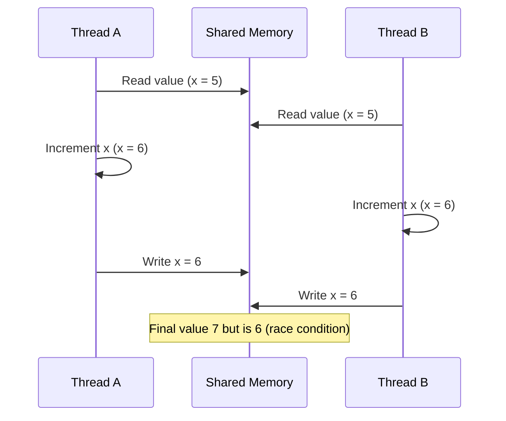

## Concept
Shared memory is an inter-process communication (IPC) mechanism where multiple processes share a region of memory. This region is created by one process using `shmget()` and then mapped into the address space of other processes via `shmat()`.

* The OS typically isolates memory between processes. However, shared memory explicitly bypasses this restriction by mutual agreement between processes.
* Once attached, processes can directly read from and write to the shared region.
* This memory is not controlled or interpreted by the OS—the processes using it define the format, meaning, and structure of the data.
* Synchronization is critical: the OS does not prevent race conditions. It’s up to the processes to ensure safe access—typically by using semaphores or mutexes.

This makes shared memory very fast for IPC, since there's no copying of data between processes, but it also requires careful coordination.

## Race Condition

A **race condition** occurs when the outcome of a program depends on the **timing or sequence** of uncontrollable events like context switches between threads or processes. It happens when:

* Two or more threads/processes **access shared data simultaneously**.
* At least one of them is **modifying the data**.
* There is **no proper synchronization** to control the access.

This can lead to **unexpected behavior**, data corruption, or crashes.

## Race Condition Scenario

In the above diagram, both threads read the same initial value and update it without knowing the other thread’s action. The final result does not reflect both increments, demonstrating a race condition.
