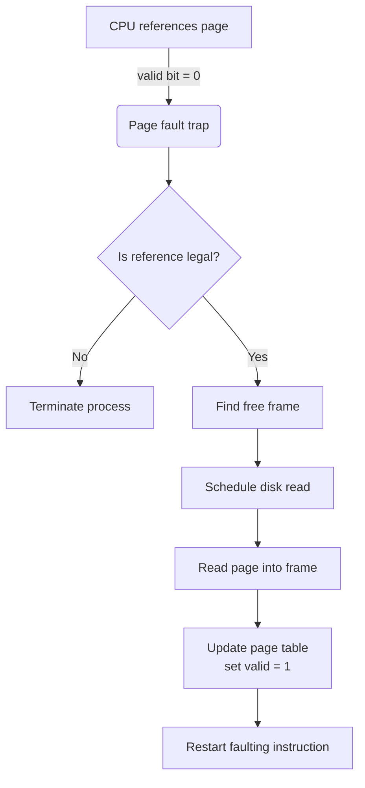

Virtual memory is an abstraction that separates a program’s logical address space (what the programmer sees) from the computer’s physical memory (the actual RAM chips).

| Benefit                 | Description                                                                    |
| ----------------------- | ------------------------------------------------------------------------------ |
| **Large address space** | A 32-bit user program can “see” 4 GiB even if the machine has far less RAM     |
| **Simpler programming** | No need for manual overlays; the OS loads pages on demand                      |
| **Page sharing**        | Multiple processes can map the same code or file pages, saving RAM             |
| **Efficient fork()**    | Copy-on-write pages let parent and child share memory until modified           |
| **Memory-mapped files** | File I/O is done by paging in/out file blocks, unifying file and memory access |

## Demand Paging

### Concept

A **demand-paging** system keeps most pages of a process on disk and loads a page only when it is referenced

* A **pager** (not a swapper) brings individual pages into RAM.
* Pages not yet referenced remain on disk; RAM is used only for active pages.

### Lazy Swapper vs. Pager

| Swapper                                       | Pager                               |
| --------------------------------------------- | ----------------------------------- |
| Moves an **entire** process in/out of memory  | Moves pages one at a time on demand |

### Hardware Support

* **Page table** entries contain a valid/invalid bit

  * **Valid = 1** → page is legal **and** in RAM.
  * **Valid = 0** → page is either not part of the process or is currently on disk.
* **Secondary memory (swap space)** to store pages that are not in RAM.

## Page Faults

### What Triggers a Page Fault?

A processor reference to a page whose **valid bit = 0**.
The MMU raises a trap to the OS

### Page-Fault Handling Steps

1. **Verify access** — illegal reference ⇒ terminate
2. **Locate a free frame** (or evict one)
3. **Read** the needed page from disk into that frame
4. **Update** the page table entry (now valid, frame number)
5. **Restart** the interrupted instruction (state saved in PCB)

> Requirement: the CPU must be able to **restart any instruction** after the page is loaded.

## Example Walk-Through

Assume a process referencing page #42:

1. MMU finds valid = 0 ⇒ page fault
2. OS sees page 42 is legal but on disk (frame = –1)
3. Picks a free frame 17, issues disk read → frame 17
4. On I/O completion, page table\[42] ← (frame 17, valid = 1)
5. CPU restarts the “load” instruction; this time the translation succeeds

## Performance Considerations

* **Page-fault rate** should be kept low; each fault entails microseconds of trap overhead **plus** milliseconds of disk latency
* **Prepaging** may pre-load pages that the pager predicts will be used soon
* **Page-replacement algorithms** (LRU, FIFO, Clock, etc.) decide which resident page to evict when no free frames remain
